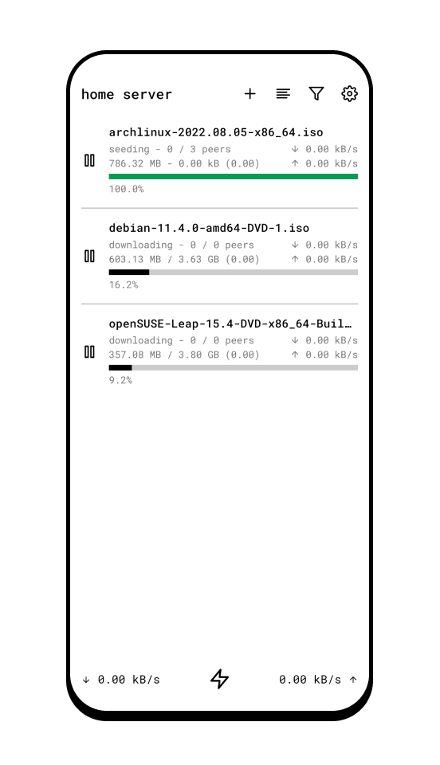
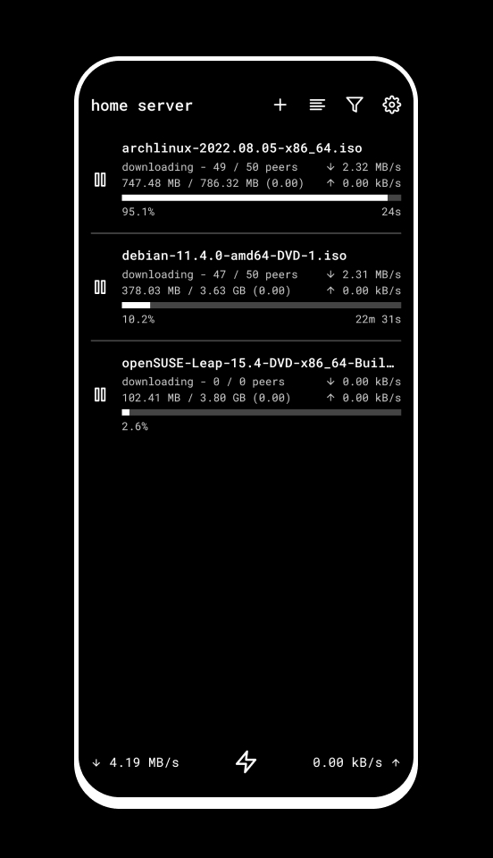
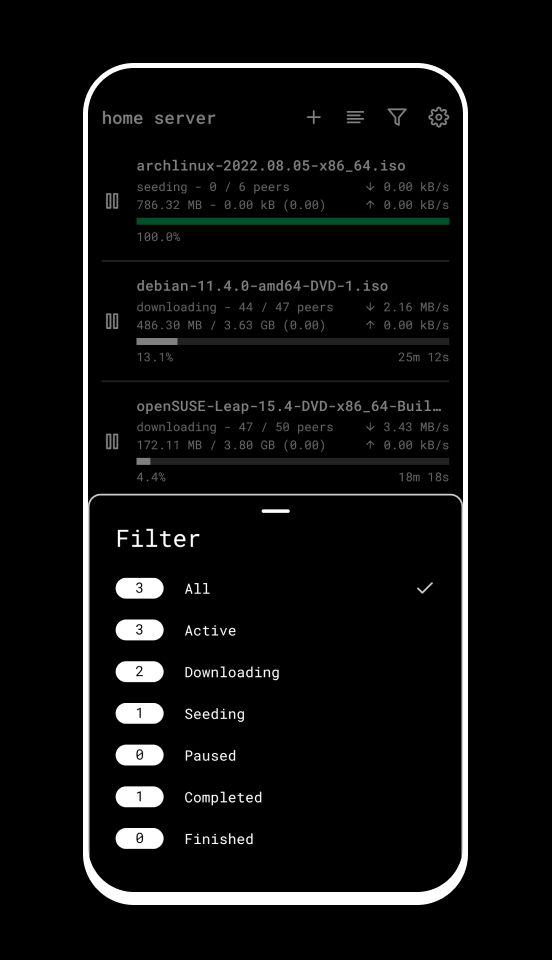
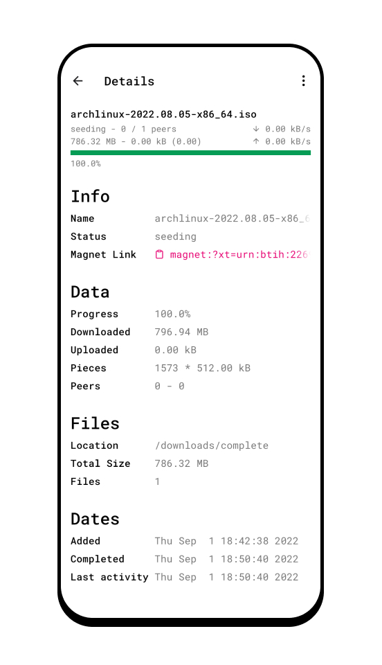
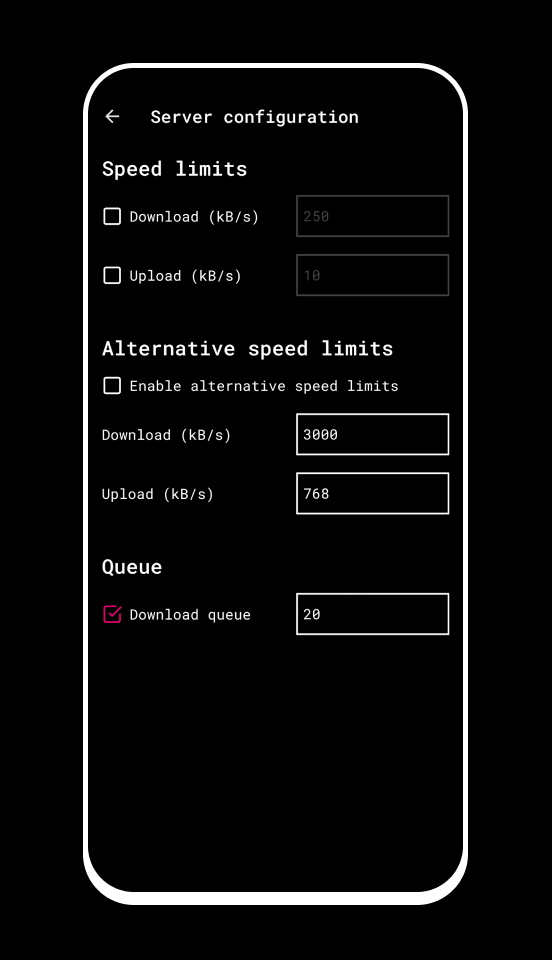

# Remote for Transmission

A React Native application client to remotely control a [Transmission BitTorrent client](https://transmissionbt.com/) instance.
Transmission is a free and open source lightweight P2P client for the BitTorrent network.

## Screenshots

  
  
  
  
  

